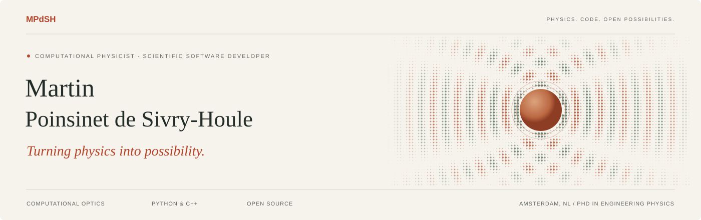
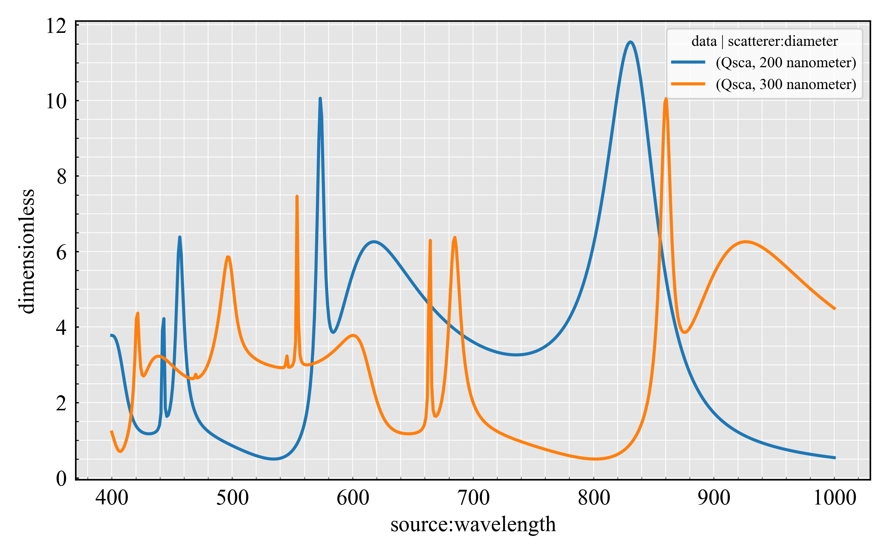
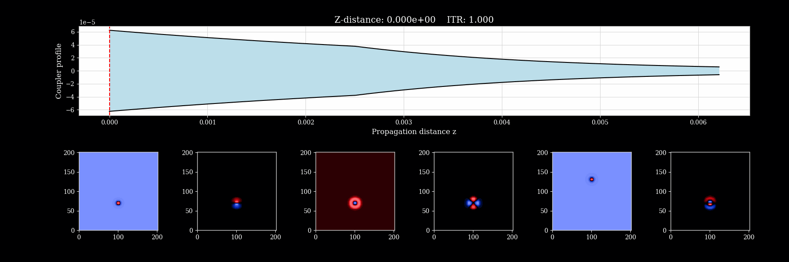
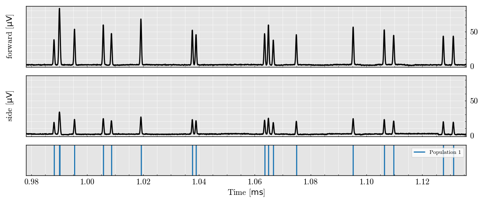
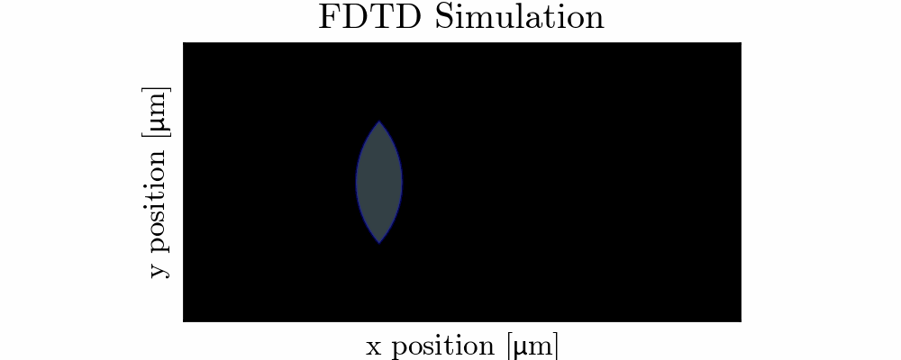
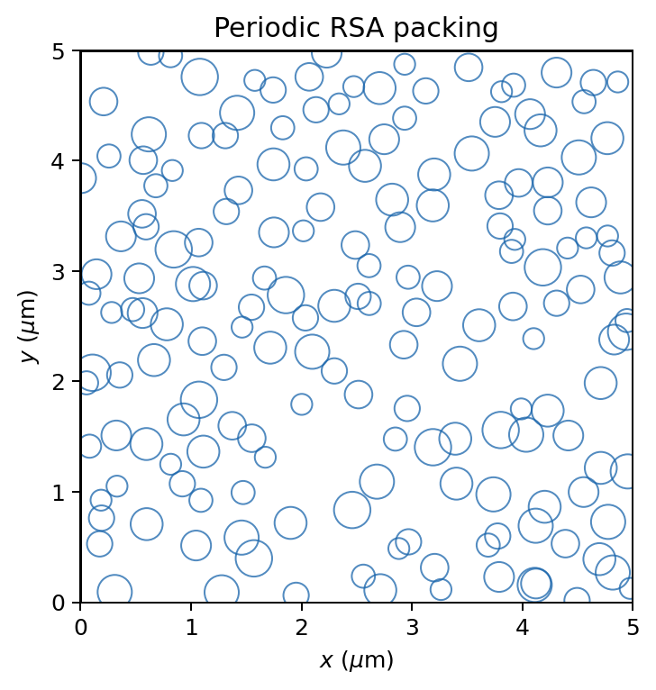
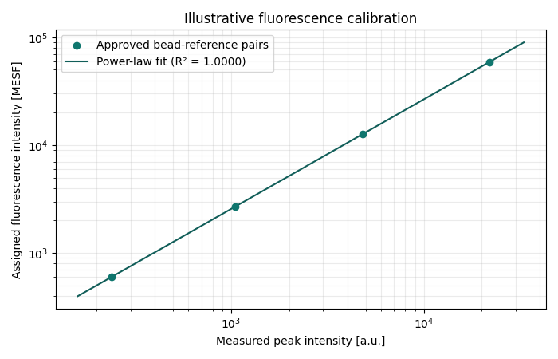
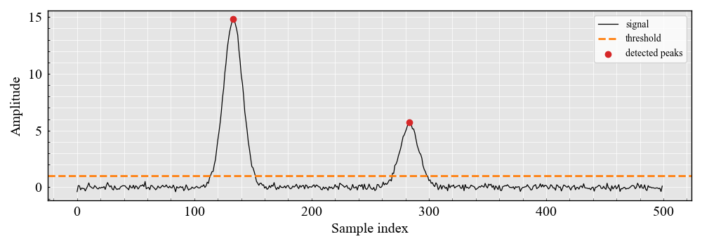

I build tools that help researchers and engineers understand optical systems—from numerical simulation to signal analysis and instrument calibration.

I’m interested in roles and collaborations that combine numerical modeling, reliable software, and experimental measurement, particularly in photonics, biomedical optics, and optical instrumentation.

[**View my CV (PDF)**](assets/Martin-Poinsinet-de-Sivry-Houle-CV.pdf) · [GitHub](https://github.com/MartinPdeS) · [Contact me](mailto:martin.poinsinet.de.sivry@gmail.com)

## Selected projects

### [PyMieSim](https://github.com/MartinPdeS/PyMieSim) · Light scattering

**The challenge.** A scattering calculation must connect particle properties to what a detector actually collects. Exploring source, particle, and detector parameters together adds a computational challenge: many optical configurations need to be evaluated consistently.

**My contribution.** I developed a Python interface around a compiled scattering backend, bringing particle solvers, illumination, detector coupling, and parameter sweeps into one configurable workflow. This connects Lorenz–Mie calculations to questions about an optical measurement.

**Publication.** [PyMieSim: an open-source library for fast and flexible far-field Mie scattering simulations](https://doi.org/10.1364/OPTCON.473102). Martin Poinsinet de Sivry-Houle, Nicolas Godbout, and Caroline Boudoux. *Optics Continuum* **2**(3), 520–534 (2023).

The paper demonstrates applications to flow cytometry geometry and few-mode optical coherence tomography.

**Python · C++ · pybind11 · Computational optics**

  

*Scattering-efficiency spectra for two particle diameters, showing size-dependent resonances.*

### [SuPyMode](https://github.com/MartinPdeS/SuPyMode) · Fiber component design

**The challenge.** Designing a fiber component requires understanding how its geometry changes the modes it supports and how power transfers between them. A useful design tool must connect these local modal properties to propagation through the component.

**My contribution.** I developed a Python/C++ toolkit combining eigenmode expansion and coupled-mode theory for fiber component analysis. It supports exploration of mode coupling and component geometry, including mode-selective photonic lanterns.

**Publication.** [SuPyMode: an open-source library for design and optimization of fiber optic components](https://doi.org/10.1364/OPTCON.513562). Martin Poinsinet de Sivry-Houle, Rodrigo Itzamna Becerra Deana, Stéphane Virally, Nicolas Godbout, and Caroline Boudoux. *Optics Continuum* **3**(2), 242–255 (2024).

The paper presents the mathematical framework, validation against analytical solutions, and a photonic-lantern design study.

**Python · C++ · Eigenmode expansion · Coupled-mode theory**

  

*Mode propagation through a tapered fiber component, showing the changing taper profile and transverse field distributions.*

### [FlowCyPy](https://github.com/MartinPdeS/FlowCyPy) · Flow cytometry simulation

**The challenge.** A measured cytometry pulse reflects the particle, illumination, fluidics, detector, electronics, and noise together. Studying these stages in isolation makes it difficult to understand which part of the instrument limits detection.

**My contribution.** I developed an end-to-end simulation framework connecting particle events and scattering physics to detector response, electronics, noise, and signal processing. This provides a controlled setting for exploring instrument configurations and testing analysis pipelines with simulated measurements.

**Publication coming soon.**

**Physical modeling · Detector simulation · Signal processing**

  

*Simulated forward and side detector signals, aligned with the particle events that produce them.*

### [LightWave2D](https://github.com/MartinPdeS/LightWave2D) · Electromagnetic wave propagation

**The challenge.** Studying propagation and diffraction means translating optical geometries into a numerical field problem, while keeping sources, spatial discretization, and boundary conditions consistent.

**My contribution.** I developed a two-dimensional FDTD simulation tool with configurable sources and optical components, backed by compiled computation. Field visualizations let users inspect how waves interact with waveguides, scatterers, gratings, and resonators.

**Python · C++ · FDTD · Numerical simulation**

  

*FDTD field propagation through a dielectric lens. Animation from the project documentation.*

### [PackLab](https://github.com/MartinPdeS/PackLab) · Particle structure and correlations

**The challenge.** Particle arrangements affect correlations and scattering, but equilibrium mixtures and irreversible deposition describe different physical processes. Treating their configurations as interchangeable can lead to misleading interpretations.

**My contribution.** I developed complementary workflows for analytical equilibrium correlations, random sequential adsorption, and Metropolis Monte Carlo sampling. They connect physical mixture inputs to particle structure and structure-aware scattering while keeping the assumptions of each method explicit.

**Publication coming soon.**

**Statistical physics · Monte Carlo · Scientific computing**

  

*A slice visualization of a three-dimensional periodic RSA packing. Circles show particles within the displayed slice thickness.*

### [RosettaX](https://github.com/MartinPdeS/RosettaX) · Measurement calibration

**The challenge.** Calibration becomes difficult to reproduce when data loading, peak selection, reference values, fits, and exported settings are spread across disconnected tools. Users need to inspect both the fitted result and the choices behind it.

**My contribution.** I developed a graphical workflow bringing FCS loading, histogram inspection, peak identification, and fluorescence and scattering calibration together. Reusable profiles and calibration exports carry those choices into subsequent analysis.

**Scientific interfaces · Calibration · Reproducible analysis**

  

*Fluorescence calibration using illustrative bead-reference pairs and a power-law fit. This documentation example uses synthetic values.*

### [DeepPeak](https://github.com/MartinPdeS/DeepPeak) · Events in noisy signals

**The challenge.** Overlapping pulses and noise can obscure individual events. A cleaner-looking signal alone does not establish better detection; evaluation must also consider event counts, arrival times, amplitudes, and widths.

**My contribution.** I developed tools for synthetic signal generation, classical peak detection, and optional neural deconvolution. Comparison workflows evaluate direct and deconvolved detection on the same traces, including dilution-series analysis.

**Signal analysis · CNNs · Neural deconvolution**

  

*Classical peak detection on a noisy synthetic trace, with the threshold and detected events shown explicitly.*

## Scientific software foundations

| Project | Focus |
| --- | --- |
| [PyOptik](https://github.com/MartinPdeS/PyOptik) | Optical material properties, refractive index, and dispersion |
| [TypedUnit](https://github.com/MartinPdeS/TypedUnit) | Physical quantities with type validation |
| [MPSPlots](https://github.com/MartinPdeS/MPSPlots) | Scientific plotting tools |

## Research background

My research centers on extracting useful information from light: how an optical system shapes a signal, what limits its measurement, and how computation can help interpret it. I have worked across numerical modeling, experimental optics, and detector systems.

### Amsterdam UMC · Postdoctoral research · 2024–present

**Biomedical optics and flow cytometry.** I develop models that connect light–particle interactions to the signals recorded by an instrument, including detector response, electronics, and noise. This work supports the study of detection limits and the evaluation of measurement and analysis pipelines.

Alongside simulation, I develop convolutional neural networks for single-particle detection and classification in time-series data, and prototype FPGA triggering logic for low-latency acquisition. These activities connect physical modeling to the practical constraints of measuring weak, noisy signals.

### Polytechnique Montréal · Doctoral research · 2018–2024

**Fiber photonics and optical imaging.** My PhD in Engineering Physics combined experimental and computational work on microscopy and optical coherence tomography, with a focus on light propagation and fiber components such as photonic lanterns.

I developed numerical tools for wave propagation and mode coupling, checked numerical results against analytical solutions, and built processing pipelines for experimental data. Working with both the optical setup and its model shaped how I approach scientific software: the assumptions must be explicit, and the outputs must be useful for interpreting a measurement.

### Earlier experience · Instrumentation and experimental physics

- **Matrox · 2016:** developed an automated protocol for industrial-camera characterization, optical testing, and measurement repeatability analysis.
- **CERN · 2014:** characterized components of the ALICE Inner Tracking System and contributed to detector testing and data analysis.
- **Université de Montréal · 2013:** contributed to experimental setup, measurements, and analysis for the PICO dark-matter detection experiment.

## How I work

I start with the physical assumptions and the quantity we need to understand, then translate the model into a numerical implementation. My software combines accessible Python interfaces with compiled computation where appropriate, supported by tests, examples, packaging, and documentation.

**Scientific computing:** Python, C++, NumPy, SciPy, pybind11, OpenMP.

**Software engineering:** CMake, Git, GitHub Actions, Pytest, Sphinx.

## Get in touch

Working on an optical simulation, a scientific computing tool, or a measurement pipeline? I’m interested in scientific software engineering and computational optics roles, as well as research collaborations that bring physical models into practical use.

**[martin.poinsinet.de.sivry@gmail.com](mailto:martin.poinsinet.de.sivry@gmail.com)** · **[GitHub / MartinPdeS](https://github.com/MartinPdeS)**
